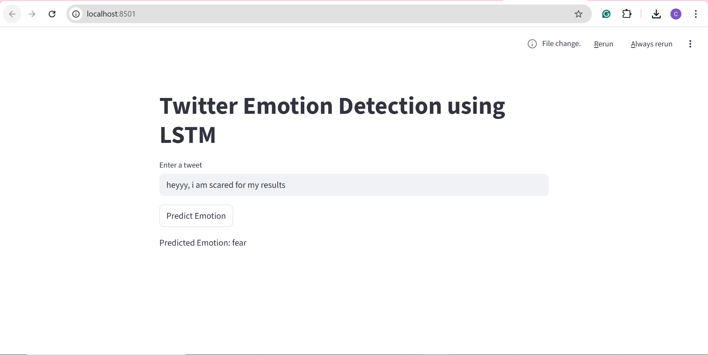

# Twitter Emotion Detection using LSTM

This project implements a Natural Language Processing (NLP) model that detects emotions in tweets using a Long Short-Term Memory (LSTM) neural network. The model classifies tweets into multiple emotion categories such as joy, sadness, anger, love, fear, and surprise.

The system includes a trained deep learning model and a web interface that allows users to input tweets and receive real-time emotion predictions.

---

## Project Overview

The goal of this project is to build an end-to-end NLP pipeline capable of analyzing textual data from social media and identifying the emotional sentiment expressed in tweets.

The project includes:

- Text preprocessing
- Tokenization and sequence padding
- LSTM-based deep learning model
- Multi-class emotion classification
- Interactive prediction interface

---

## Technologies Used

- Python
- TensorFlow / Keras
- Natural Language Processing (NLP)
- LSTM Neural Networks
- Streamlit
- NLTK
- Pandas
- Scikit-learn

---

## Model Architecture

The emotion detection model follows the pipeline below:

Tweet Input
↓
Text Cleaning
↓
Tokenization
↓
Sequence Padding
↓
Embedding Layer
↓
LSTM Layer
↓
Dense Softmax Layer
↓
Emotion Prediction

The LSTM network is used because it can capture sequential patterns and contextual relationships in textual data.

---

## Dataset

The model is trained on a labeled dataset of tweets where each tweet is tagged with an emotion label.

Emotion classes include:

- Joy  
- Sadness  
- Anger  
- Love  
- Fear  
- Surprise  

---

## Project Structure

twitter-emotion-detection
│
├── dataset
│ └── train.txt
│
├── model
│ └── emotion_model.h5
│
├── train_model.py
│
├── app.py
│
├── requirements.txt
│
└── README.md

---

## How to Run the Project

### 1 Install dependencies

pip install -r requirements.txt

### 2 Train the model

python train_model.py

This will generate the trained model file:

model/emotion_model.h5

### 3 Run the web application

streamlit run app.py

### 4 Open the application

After running the Streamlit command, open your browser and go to:

http://localhost:8501

You can now enter any tweet and the system will predict the emotion.

---

## Example

Input tweet:

I am feeling really happy today

Output:

Predicted Emotion: Joy

---

## Application Interface

## Future Improvements

Possible enhancements to this project include:

- Using pretrained word embeddings such as GloVe
- Improving handling of negation words
- Adding attention mechanisms to the LSTM model
- Deploying the application on a cloud platform
- Expanding the dataset for better generalization

---

## Author

Chhavi Siddarth Wadhwa  
B.Tech Computer Science

Chirag Basanth Bellavi
B.tech Computer Science

